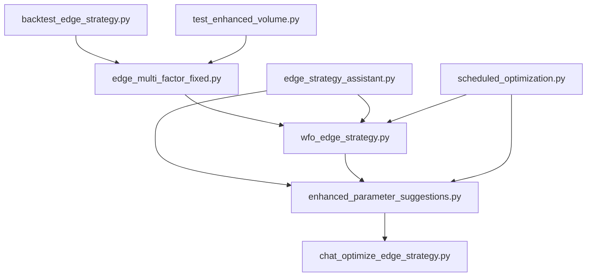

# Crypto Trading Bot Strategy Architecture

## Component Overview and Interactions



## Core Components

### 1. Edge Multi-Factor Strategy (`edge_multi_factor_fixed.py`)
**Purpose:** Base strategy implementation
```python
class EdgeMultiFactorStrategy:
    def __init__(self, **params):
        # Initialize strategy parameters
        
    def generate_signals(self, data):
        # Generate trading signals
```
- Implements core trading logic
- Manages technical indicators (RSI, Bollinger Bands, etc.)
- Handles position sizing and risk management
- Features enhanced volume detection system
- Used by: `wfo_edge_strategy.py`, `backtest_edge_strategy.py`, `test_enhanced_volume.py`

### 2. Walk-Forward Optimization (`wfo_edge_strategy.py`)
**Purpose:** Parameter optimization and strategy validation
```python
def run_walk_forward_optimization():
    # Main WFO process
    
def optimize_parameters(data, params_space):
    # Parameter optimization using Optuna
```
- Implements walk-forward optimization
- Manages parameter optimization
- Calculates performance metrics
- Interfaces with: `edge_multi_factor_fixed.py`, `edge_strategy_assistant.py`

### 3. Strategy Assistant (`edge_strategy_assistant.py`)
**Purpose:** AI-powered strategy enhancement
```python
class EdgeStrategyAssistant:
    def get_parameter_suggestions(self):
        # AI-powered parameter suggestions
        
    def analyze_market_regime(self):
        # Market condition analysis
```
- Provides AI-assisted optimization
- Analyzes market conditions
- Suggests parameter adjustments
- Used by: `enhanced_parameter_suggestions.py`, `chat_optimize_edge_strategy.py`

## Optimization Components

### 4. Enhanced Parameter Suggestions (`enhanced_parameter_suggestions.py`)
**Purpose:** Advanced parameter optimization
```python
def generate_enhanced_parameters():
    # Generate optimized parameters
    
def validate_parameters():
    # Validate parameter effectiveness
```
- Implements market-aware parameter tuning
- Validates parameter suggestions
- Integrates AI model insights
- Interfaces with: `edge_strategy_assistant.py`, `wfo_edge_strategy.py`

### 5. Chat Optimization (`chat_optimize_edge_strategy.py`)
**Purpose:** Interactive strategy optimization
```python
def optimize_with_chat():
    # Interactive optimization process
    
def get_chat_suggestions():
    # Get AI suggestions for parameters
```
- Provides interactive parameter tuning
- Integrates with AI chat models
- Uses: `edge_strategy_assistant.py`

### 6. Scheduled Optimization (`scheduled_optimization.py`)
**Purpose:** Automated optimization
```python
def run_scheduled_optimization():
    # Regular optimization process
    
def update_parameters():
    # Update strategy parameters
```
- Manages automated optimization schedule
- Updates parameters periodically
- Uses: `wfo_edge_strategy.py`, `enhanced_parameter_suggestions.py`

## Analysis Components

### 7. Backtest Edge Strategy (`backtest_edge_strategy.py`)
**Purpose:** Strategy backtesting
```python
def run_backtest():
    # Execute strategy backtest
    
def analyze_performance():
    # Analyze backtest results
```
- Implements strategy backtesting
- Analyzes performance metrics
- Uses: `edge_multi_factor_fixed.py`

### 8. Enhanced Volume Test (`test_enhanced_volume.py`)
**Purpose:** Test enhanced volume detection
```python
def main():
    # Test enhanced volume detection
    
def plot_comparison():
    # Compare enhanced and original volume
```
- Tests enhanced volume detection algorithm
- Compares to original volume detection
- Creates visualization of results
- Uses: `edge_multi_factor_fixed.py`

## Data Flow

1. **Strategy Development Flow:**
   ```
   edge_multi_factor_fixed.py (Base Strategy)
   ↓
   backtest_edge_strategy.py (Initial Testing)
   ↓
   wfo_edge_strategy.py (Optimization)
   ↓
   enhanced_parameter_suggestions.py (Fine-tuning)
   ```

2. **Optimization Flow:**
   ```
   edge_strategy_assistant.py (AI Analysis)
   ↓
   enhanced_parameter_suggestions.py (Parameter Generation)
   ↓
   wfo_edge_strategy.py (Validation)
   ↓
   scheduled_optimization.py (Automated Updates)
   ```

3. **Interactive Optimization Flow:**
   ```
   chat_optimize_edge_strategy.py (User Input)
   ↓
   edge_strategy_assistant.py (AI Processing)
   ↓
   enhanced_parameter_suggestions.py (Parameter Validation)
   ↓
   wfo_edge_strategy.py (Implementation)
   ```

4. **Volume Detection Test Flow:**
   ```
   edge_multi_factor_fixed.py (Enhanced Volume Detection)
   ↓
   test_enhanced_volume.py (Comparison Testing)
   ↓
   enhanced_vs_original_volume.png (Visual Analysis)
   ```

## Key Interactions

1. **Parameter Optimization Chain:**
   - `edge_strategy_assistant.py` provides initial parameter suggestions
   - `enhanced_parameter_suggestions.py` refines these suggestions
   - `wfo_edge_strategy.py` validates and implements the parameters
   - `scheduled_optimization.py` automates this process

2. **Strategy Development Chain:**
   - `edge_multi_factor_fixed.py` provides core strategy logic
   - `backtest_edge_strategy.py` tests strategy performance
   - `wfo_edge_strategy.py` optimizes strategy parameters
   - `chat_optimize_edge_strategy.py` allows for manual refinement

3. **AI Integration Chain:**
   - `edge_strategy_assistant.py` manages AI interactions
   - `chat_optimize_edge_strategy.py` provides user interface
   - `enhanced_parameter_suggestions.py` implements AI suggestions
   - `scheduled_optimization.py` automates the process

4. **Volume Detection Enhancement Chain:**
   - `edge_multi_factor_fixed.py` implements enhanced volume detection
   - `test_enhanced_volume.py` validates the enhancement
   - Parameter profiles in `config/strategy_params.json` store configurations
   - Documentation in `docs/enhanced_volume_detection.md` explains the feature

## Configuration Dependencies

All components rely on these configuration sources:
- `.env` file for API keys and credentials
- `config/strategy_params.json` for parameter profiles including `enhanced_volume`
- `vectorbtpro` settings for backtesting configuration

## Error Handling and Logging

Each component implements:
- Detailed logging of operations
- Error recovery mechanisms
- Parameter validation
- Performance metric tracking

## Testing Structure

Test files validate:
- Strategy logic (`test_edge_multi_factor_fixed.py`)
- AI assistance (`test_edge_assistant.py`)
- Volume detection (`test_enhanced_volume.py`)
- Optimization processes (various test files)

## Future Enhancements

Planned improvements:
1. Enhanced market regime detection
2. More sophisticated AI parameter suggestions
3. Improved optimization algorithms
4. Better performance metrics and visualization
5. Adaptive volume thresholds based on market conditions
6. Time-based filtering for volume signals
7. Improved exit strategies based on volume patterns 